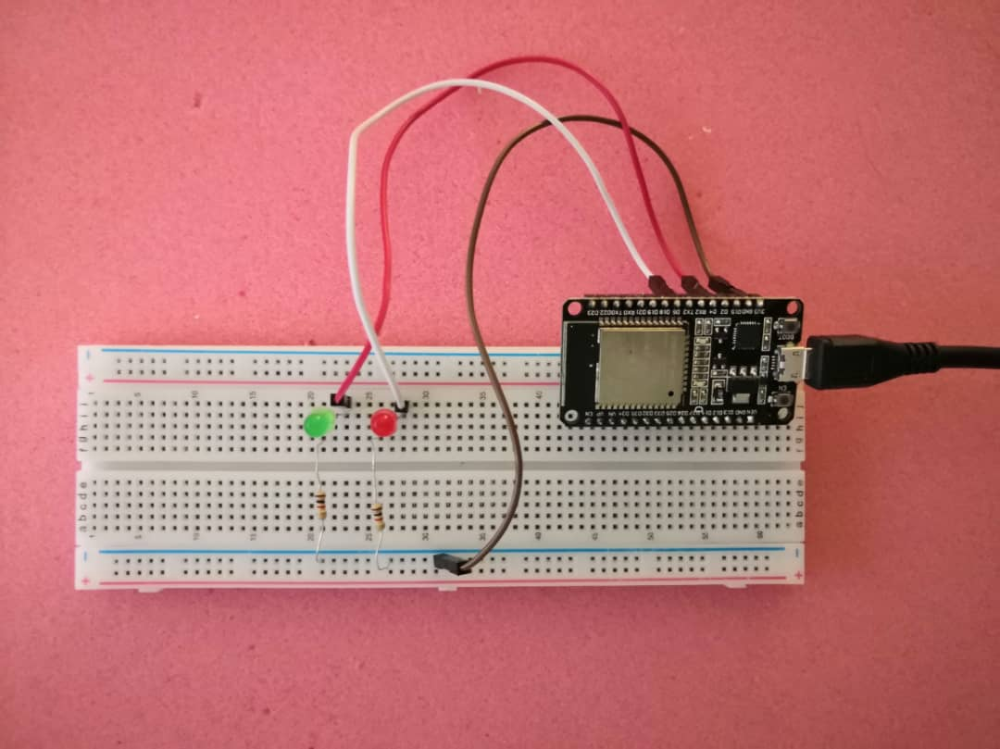

Blinky 2 LEDs

  
  

Issue

  
  
1. Instead of applying xTaskCreatePinnedtoCore, do only apply xTaskCreate.  

2. If builtin LED is used, make sure that the led rate from both tasks does not have same interval.  
Correct: 500, 300  
Wrong: 500, 1000  

